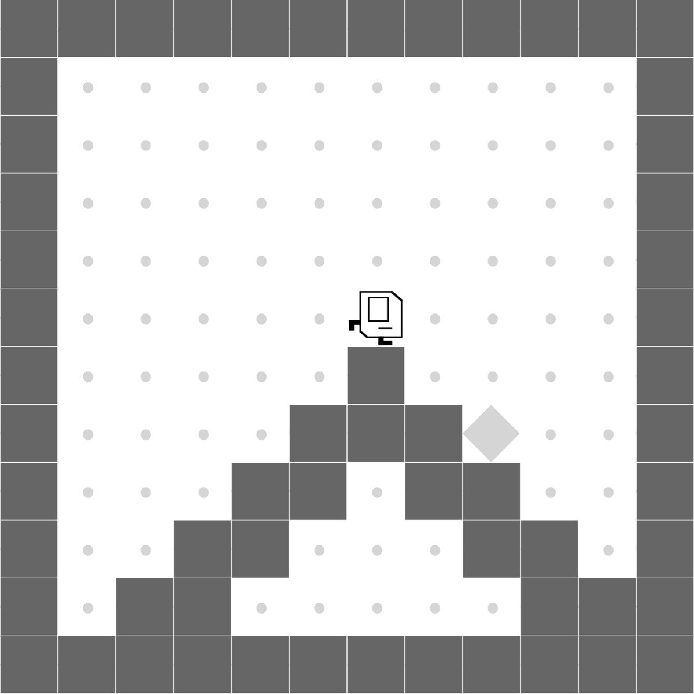

# Program Synthesis for Robot Learning

Deep reinforcement learning (RL) has led to encouraging successes in numerous challenging robotics applications. However, the lack of inductive biases to support logic deduction and generalization in the representation of deep RL models makes them less effective in exploring complex long-horizon robot-control tasks with sparse reward signals. Existing program synthesis algorithms for RL problems inherit this limitation, as they either adapt conventional RL algorithms to guide program search or synthesize robot-control programs to imitate an RL model. We propose ReGuS, a reward-guided synthesis paradigm, to unlock the potential of program synthesis in overcoming exploration challenges. We develop a novel hierarchical synthesis algorithm with a decomposed search space for loops, on-demand synthesis of conditional statements, and curriculum synthesis for procedure calls, effectively compressing the exploration space for long-horizon, multi-stage, and procedural robot-control tasks that are difficult to address with conventional RL techniques. Experimental results demonstrate that ReGuS significantly outperforms state-of-the-art RL algorithms and standard program synthesis baselines on challenging robot tasks including autonomous driving, locomotion control, and object manipulation.

## Getting Started Guide

We recommend machines have at least 16GB of memory and 16GB of hard disk space available when building and running Docker images. All benchmarks were tested on a Mac Mini 2023 containing an Apple M2 Pro CPU and 16GB of RAM.

### Requirements

This artifact is built as a Docker image. Before proceeding, ensure Docker is installed. ((```sudo docker run hello-world``` will test your installation.) If Docker is not installed, please install it via the [official installation guide](https://docs.docker.com/get-docker/). This guide was tested using Docker version 20.10.23, but any contemporary Docker version is expected to work.

### Use Pre-built Docker Image

You can fetch our pre-built Docker image from Docker Hub:

```
docker pull gfc669/pldi_new:latest
```

To launch a shell in the docker image:
```
docker run --platform linux/x86_64 -it gfc669/pldi_new
```

Enter the root path of the code:
```
cd ~/code/ReGuS
```


### Basis Test

To verify the tool is operating successfully, navigate to the entire directory ```Get_Start```.
```
cd Get_Start
```

Enter the anaconda environment ```ReGus```:
```
conda activate regus
```

Then run the simple test script：
```
python simple_test.py
```

The script will test several programs in related environments. A successful test will output several warnings that can be ignored on the terminal and, more importantly, three "test success" messages as follows:
```
Simple Test Ant Case: Success
Simple Test Karel Case: Success
Simple Test Highway Case: Success
```

A failed test will output at least one line of ```Test Fail```. A successful test indicates that the system is ready to evaluate the artifact.

After the test, please exit the anaconda virtual environment by:
```
conda deactivate
```


## Guidance for Reproducing the Results in the Paper: Step-by-Step Instructions

In this section, we provide a general introduction to evaluate our artifacts. Detailed instructions are included in each related directory. For the proposed ReGuS, we provide the evaluation in 5 popular RL tasks, including Karel, Highway, Ant, Fetch, and MiniGrid environments. For each environment, we provide a separate directory to cover all related evaluation cases which will be introduced in the following paragraphs. In addition, we also provide artifacts to reproduce baseline results in our paper, including DRL and DRL-abs. Similarly, evaluations of baselines are gathered in respective directories.

### Conda Virtual Environment

Generally, we have two conda environments in the docker, ```regus``` and ```regus2```. To run ReGuS for Karel, Highway and Ant environments, please activate ```regus```; to run ReGus for Fetch and MiniGrid environments, please activate ```regus2```.

### Karel Environment

The directory ```Karel_Script``` contains the code of the ReGuS method solving Karel tasks (e.g., **Fig.17. of paper**), including cleanHouse, fourCorners, stairClimber, topOff, randomMaze, harvester, seeder, and doorkey puzzles. For each puzzle, users can expect visualization results with reward-timestep figures (e.g., refer to **Fig.18. of paper**) showing the performance of ReGuS and a log file showing searched and successful programs synthesized by ReGuS.

### Highway Environment

The directory ```Highway_Script``` encapsulates the artifact of ReGuS solving the continuous state space task, specifically the Highway Driving Environment (e.g., **Leftmost figure of Fig.21. of the paper**). The proposed script will generalize ReGuS performance with a reward-timestep figure (e.g., **Fig. 22(a) of the paper**) and log files showing synthesized programs by our method.

### Ant Environment

The directory ```Ant_Script``` covers the ReGuS method handling Ant tasks with continuous state space environments, including U-shaped Maze, S-shaped maze, $\pi$-shaped maze, and W-shaped maze (e.g., images of mazes are shown in the right four of **Fig.21. in the paper**). To evaluate ReGuS, we synthesize programs from the Ant-U Maze and enhance the success program from the Ant-U Maze on the Ant-S environment. All synthesized complete programs will be evaluated on all four maze puzzles, and the result will be presented in a solved number-time step figure (e.g., **Fig. 22(d) of the paper**). Log files showing synthesis footprints will also be stored as a result.

### Fetch Environment

The directory ```Fetch_Script``` contains the Fetch-Pick&Place and Fetch-Hook environments. These two environments are used in Figure 22 (b)(c). The synthesized programs will be saved, and the reward curves can be plotted using the provided script.

### MiniGrid Environment

The directory ```Minigrid_Script``` contains the curriculum synthesis part of ReGuS. Programs synthesized for simple environments can be used as building blocks for complicated environments. The synthesized program and the environment steps used will be saved as results.

### Baselines

The directory ```DRL``` contains evaluation code for the baseline method DRL on Karel, Highway, and Ant environments. We mainly applied the PPO method with the Stable-Baselines 3 framework as DRL and evaluated with the same setting as ReGuS.

The directory ```r2l``` contains evaluation artifacts for the baseline method DRL-abs on Karel, Highway, and Ant environments. The baseline is modified based on the [R2L framework](https://github.com/siekmanj/r2l).

Besides, we also provide a visualization tool to combine the result data of baselines and ReGuS and create figures of the Karel, Highway, and Ant environment (e.g.,  **Fig.18, 22 in the paper**) in the directory ```Visualization```.


## Guidance for Reusing Our Artifact for New Use Cases: Step-by-Step Instructions

 In the first example, we assume the Highway environment to be the new environment and take the Karel environment as an existing template. We will modify modules from the Karel script step-by-step to adapt ReGuS to the Highway environment. In the second example, we introduce a new Karel task, Karel UpDown-StairClimber, and show how to reuse code from the Karel script to run ReGuS in this task.


In this section, we present three examples illustrating how to utilize ReGuS for a new user-developed environment.

1. **Example 1: Applying ReGuS to a New Karel Environment (UpDown-StairClimber):**
   Here, we introduce a fresh Karel task, namely Karel UpDown-StairClimber, and outline the process of reusing code from the Karel script to execute ReGuS for this particular task.

2. **Example 2: Adapting ReGuS to a New User-defined Environment:**
   We illustrate how to use the Karel environment as a template to define new robot tasks for ReGuS. Specifically, we show how to modify the modules from the Karel script to adapt ReGuS to the Highway environment.

3. **Example 3: Applying ReGuS to Variants of Existing Environments**
   We illustrate the steps involved in modifying the existing robot environments available in the repository and evaluating ReGuS's performance on these customized variants.

### Example 1: Applying ReGuS to a New Karel Environment (UpDown-StairClimber)

We outline the process of reusing code from the Karel script to execute ReGuS for a new UpDown-StairClimber task. The following is the structure of ```Karel Script```:

```
Karel Script
|    dsl_karel.py
|    search_karel.py
|    mcts_search.py
|    do_search.sh
|
|____karel
|    |    checker.py
|    |    dsl.py
|    |    generator.py
|    |    karel.py
|    |    robot.py
|    |    [other files for karel environment]
|
|____mcts
|    |    MCTS_search_tree.py
|    |    search_alg.py
|    |
|____utils
|    |    [files for utils]
```

#### Environment Definition

<figure>
<p align='center'>

<center>
<hr><br>
</figure>

In the Karel StairClimber task, the agent is tasked with ascending stairs, while in the new Karel UpDown-StairClimber task, the agent must ascend stairs first and then descend. To incorporate the Karel UpDown-StairClimber task, users simply need to integrate task generation in `karel/generator.py` and update `karel/robot.py` to define the environment layout such as the locations of the stairs. The modification can be implemented as follows:
```
# karel/generator.py
    def generate_single_state_up_down_stair_climber(self, h=12, w=12, wall_prob=0.1, env_task_metadata={}):
        s = np.zeros([h, w, 16]) > 0
        # Wall
        s[0, :, 4] = True
        s[h-1, :, 4] = True
        s[:, 0, 4] = True
        s[:, w-1, 4] = True

        random.seed(self.seed)

        world_map = [
            ['-', '-', '-', '-', '-', '-', '-', '-', '-', '-', '-', '-'],
            ['-',   0,   0,   0,   0,   0,   0,   0,   0,   0,   0, '-'],
            ['-',   0,   0,   0,   0,   0,   0,   0,   0,   0,   0, '-'],
            ['-',   0,   0,   0,   0,   0,   0,   0,   0,   0,   0, '-'],
            ['-',   0,   0,   0,   0,   0,   0,   0,   0,   0,   0, '-'],
            ['-',   0,   0,   0,   0,   0,   0,   0,   0,   0,   0, '-'],
            ['-',   0,   0,   0,   0,   0,   0,   0,   0,   0,   0, '-'],
            ['-',   0,   0,   0,   0,   0, '-',   0,   0,   0,   0, '-'],
            ['-',   0,   0,   0,   0, '-', '-', '-',   0,   0,   0, '-'],
            ['-',   0,   0,   0, '-', '-',   0, '-', '-',   0,   0, '-'],
            ['-',   0,   0, '-', '-',   0,   0,   0, '-', '-',   0, '-'],
            ['-',   0, '-', '-',   0,   0,   0,   0,   0, '-', '-', '-'],
            ['-', '-', '-', '-', '-', '-', '-', '-', '-', '-', '-', '-'],
        ]
        ...

# karel/robot.py
class KarelRobot:
    def state_init(self, gen, task):
        ...
        elif task == 'upDown':
            gen_function = gen_function_base + 'up_down_stair_climber'
        ...
```

Additionally, users need to define a reward function for this new task in ```karel/checker.py```. This function checks a robot trajectory and assigns a reward based on criteria such as whether a goal state is reached. Users should update ```karel/robot.py``` to import this function for reward assignment. These modifications can be implemented as shown below:
```
# karel/checker.py
def newChecker(Checker):
    ...

# karel/robot.py
class KarelRobot:
    def checker_init(self, task):
        ...
        elif task == 'newTask':
            checker = newChecker(self.init_state)
        return checker
```
For the Karel UpDown-StairClimber task, we opted to reuse the reward function from the Karel StairClimber task instead of creating a new one:
```
# karel/robot.py
class KarelRobot:
    def checker_init(self, task):
        ...
        elif task == 'upDown':
            checker = SparseStairClimberChecker(self.init_state)
        return checker
```

Besides the above modifications, users can reuse all other parts of the ReGuS code for a new Karel task. The resulting file structure is as follows:
```
Karel Script
|    dsl_karel.py
|    search_karel.py
|    mcts_search.py
|    do_search.sh
|
|____karel
|    |    checker.py
|    |    dsl.py
|    |    generator.py (updated)
|    |    karel.py
|    |    robot.py (updated)
|    |    [other files for karel environment]
|
|____mcts
|    |    MCTS_search_tree.py
|    |    search_alg.py
|
|____utils
|    |    [files for utils]
```

We have already provided an example implementation for Karel UpDown-StairClimber. Users can run the experiment by:
```
python mcts_search.py --task 'upDown' --num_exps 1
```

### Example 2: Adapting ReGuS to a New User-defined Environment (Highway Environment)

Using the Karel script as an existing template, we can adapt it to support a new robot environment. Here we show how to modify the modules from the Karel script to derive the Highway environment. We start by copying the Karel script and renaming the new script as ```ReGuS Script```:
```
ReGus Script
|    dsl_karel.py
|    search_karel.py
|    mcts_search.py
|    do_search.sh
|
|____karel
|    |    [files for Karel environment]
|
|____mcts
|    |    MCTS_search_tree.py
|    |    search_alg.py
|
|____utils
|    |    [files for utils]
```

#### Environment Definition

In the above ```ReGuS Script```, the ```karel``` directory defines the Karel environment and tasks. Since the Highway environment has a completely different definition, this module needs the following updates:

```
ReGus Script
|    dsl_karel.py
|    search_karel.py
|    mcts_search.py
|    do_search.sh
|
|____highway (updated)
|    |    [files from Highway GitHub]
|    |    dsl.py
|    |    robot.py
|
|____mcts
|    |    MCTS_search_tree.py
|    |    search_alg.py
|
|____utils
|    |    [files for utils]
```

Download the environment directory from [Highway GitHub](https://github.com/Farama-Foundation/HighwayEnv) and rename it as ```highway```, which includes code for the low-level vehicle dynamics. In order to run ReGuS, we need to define robot perceptions and actions in a DSL accessible by synthesized programs. We define perception predicates to track vehicles in the current lane, left lane, and right lane as *front_is_clear*, *left_is_clear* and *right_is_clear*, respectively. We also need to introduce the actions that the robot can perform in the environment to the DSL. We have *faster* and *slower* to increase and decrease the velocity of the ego vehicle, respectively, and *idle* to maintain the current velocity. We also have *Lane_left* and *Lane_right* to control the ego vehicle to navigate into the left and right lanes, respectively. Correspondently, the code in ```highway/dsl.py``` may include:
```
# highway dsl

# perceptions: front_is_clear, left_is_clear, right_is_clear
class h_cond_without_not:
    ...

# handle not logic
class h_cond:
    ...

# actions: faster, slower, idle, lane_left, lane_right
class h_action:
    ...
```
The class *h_cond_without_not* in ```highway/dsl.py``` implements the perception predicates. One strategy is to implement "frontIsClear" as a predicate to assess if the predicted time-to-collision of observed vehicles on the same lane as the ego-vehicle is beyond a certain threshold, determined by their current speed and position. Similar predicates can be defined to assess clearance on the left and right lanes, assuming the ego-vehicle was to drive on those lanes. The class *h_cond* is meant to handle the **not** logical operation on perceptions. The class *h_action* in ```highway/dsl.py``` simply exports the environment actions (e.g. *Lane_right*) to the DSL. For detailed implementation, please refer to  ```Highway_script/highway_general/dsl.py```.

Then in ```highway/robot.py```, one needs to rewrite environment initialization (reset), environment state-action transition (execute_single_action, execute_single_cond), and reward definition (custom_reward). These functions simply invoke the corresponding reset, step, and reward functions from the downloaded low-level Highway environment. For detailed implementation, please refer to ```Highway_script/highway_general/robot.py```. A summary of this file is shown below:
```
# highway robot

class HighwayRobot:
    def __init__(self, task, seed):
        self.env = gym.make(task, render_mode='rgb_array')
        ...

    # initialization
    def reset(self):
        ...

    # transition given action
    def execute_single_action(self, action):
        ...

    # results for a perception
    def execute_single_cond(self, cond):
        ...

    # reward function on top of highway
    # as opposed to the Karel environment, the reward of the highway environment is directly defined here
    def custom_reward(self):
        ...
```

#### Domain Specific Language (DSL)

As noted in the paper, we need to define a DSL for program synthesis. The majority of the DSL components are general and not specific to an environment. Therefore, we can reuse ```dsl_karel.py``` with slight adjustments and renamed it as ```dsl_highway.py```. The updated file structure is presented below:
```
ReGus Script
|    dsl_highway.py (updated)
|    search_karel.py
|    mcts_search.py
|    do_search.sh
|
|____highway (updated)
|    |    [files from Highway GitHub]
|    |    dsl.py
|    |    robot.py
|
|____mcts
|    |    MCTS_search_tree.py
|    |    search_alg.py
|
|____utils
|    |    [files for utils]
```

In the DSL, action statements and perception conditions are specific to an environment and need to be rewritten. Specifically, one needs to revise the ```ACTION_DICT``` in ```dsl_highway.py``` to include the action statements for Highway as follows:
```
from highway.dsl import h_action
ACTION_DICT = {
    'lane_left'   : h_action(0),
    'idle'        : h_action(1),
    'lane_right'  : h_action(2),
    'faster'      : h_action(3),
    'slower'      : h_action(4)
}
```

Moreover, one needs to rewrite ```COND_DICT``` and ```ABS_STATE``` in ```dsl_highway.py``` for the new perception functions for Highway as:
```
from highway.dsl import h_cond, h_cond_without_not
# perception conditions
COND_DICT = {
    'front_is_clear_3'    : h_cond(negation=False, cond=h_cond_without_not('front_is_clear_3')),
    'left_is_clear_3'     : h_cond(negation=False, cond=h_cond_without_not('left_is_clear_3')),
    'right_is_clear_3'    : h_cond(negation=False, cond=h_cond_without_not('right_is_clear_3')),
    'all_true'          : h_cond(negation=False, cond=h_cond_without_not('all_true')),
    'not(front_is_clear_3)'    : h_cond(negation=True, cond=h_cond_without_not('front_is_clear_3')),
    'not(left_is_clear_3)'     : h_cond(negation=True, cond=h_cond_without_not('left_is_clear_3')),
    'not(right_is_clear_3)'    : h_cond(negation=True, cond=h_cond_without_not('right_is_clear_3')),
}

# abstract state
class ABS_STATE:
    def __init__(self):
        self.state = {
            'front_is_clear_3'    : None,
            'left_is_clear_3'     : None,
            'right_is_clear_3'    : None,
        }
```

**DSL for Program Synthesis** Other parts of the code of ```dsl_highway.py``` can be reused by replacing all occurrences of ```k_cond``` with ```h_cond```.


#### The ReGuS Algorithm

The other files, including ```search_karel.py```, ```mcts_search.py``` and directory ```MCTS```, implement the core components of the ReGuS algorithm. Only minor modifications are necessary to adapt this code for reuse in a new environment. We will outline these required adjustments in the remainder of this section.

```
ReGuS Script
|    dsl_highway.py (updated)
|    search_highway.py (updated)
|    mcts_search.py (updated)
|    do_search.sh
|
|____highway (updated)
|    |    [files from Highway GitHub]
|    |    dsl.py
|    |    robot.py
|
|____mcts (updated)
|    |    MCTS_search_tree.py
|    |    search_alg.py
|
|____utils
|    |    [files for utils]
```

First, we rename  ```search_karel.py``` into ```search_highway.py```. To adapt this file for the Highway environment, users will need to modify lines 11 and 12 to import the environment definitions specific to the Highway setup. Additionally, lines 81-86 should be adjusted to initialize the Highway environment appropriately. The remaining code in ```search_highway.py``` can be reused as is, without any additional modifications. (For more details, refer to ```Highway_script/search_highway_new.py```).
```
# search_highway.py

# line 11-12
from dsl_highway import *
from highway.robot import HighwayRobot

# line 81
self.robot_store = {self.seed: HighwayRobot(self.task, seed=self.seed, view=view_mode, config_set=config_set)}

# line 84
self.robot_store[e] = HighwayRobot(self.task, seed=e, view=view_mode, config_set=config_set)

# line 86
self.eval_robot_store[e] = HighwayRobot(self.task, seed=e, view=view_mode, config_set=config_set)
```

For ```mcts_search.py```, one needs to modify line 4 to import the DSL for the Highway environment as
```
# mcts_search.py

# line 4
from dsl_highway imoprt *
```

Similarly, for ```mcts/MCTS_search_tree.py```, one needs to modify line 3 to import the DSL for the Highway environment. And for ```mcts/search_alg.py```, one needs to modify line 12 to import the program synthesizer as follows (More details in ```Highway_script/mcts```):
```
# line 3 of mcts/MCTS_search_tree.py
from dsl_highway imoprt *

# line 12 of mcts/search_alg.py
from search_highway import Node
```

Executing the following command:
```
python mcts_search.py --num_exps 1
```
will then enable ReGuS to operate within the new Highway environment.


### Example 3: Applying ReGuS to Variants of Existing Environments

We illustrate the steps involved in modifying the existing robot environments available in the repository and evaluating ReGuS's performance on these customized variants. We use the Fetch Pick&Place environment as an example.

Similar to what is discussed above on defining the Highway environment, the perception predicates for Fetch Pick&Place can be configured by adjusting the `COND_DICT` dictionary defined at line 39 - 80 in ```Fetch_Script/robot_dsl.py```.

    ```
    COND_DICT = {
        "block_at_goal": k_cond(
            negation=False, cond=k_cond_without_not("block_at_goal")
        ),
        ...
        "not(block_at_goal)": k_cond(
            negation=True, cond=k_cond_without_not("block_at_goal")
        ),
    }
    ```
The definition of the perception predicates can be located in ```Fetch_Script/reskill/rl/envs/fetch_pick_and_place.py```. For instance, the ```block_at_goal``` predicate is defined between lines 554 and 557 of this file. Users can define a new predicate by providing a function that determines the set of states where the predicate holds true there, and then include it in the ```COND_DICT``` dictionary (see above). Additionally, users can comment out predicates referenced in ```COND_DICT``` to disable specific predicates within the DSL. It is anticipated that by removing exactly one predicate among `block_is_grasped`, `block_inside_gripper`, and `gripper_open` from ```COND_DICT```, ReGuS can still generate successful programs for the Fetch Pick&Place environment.
